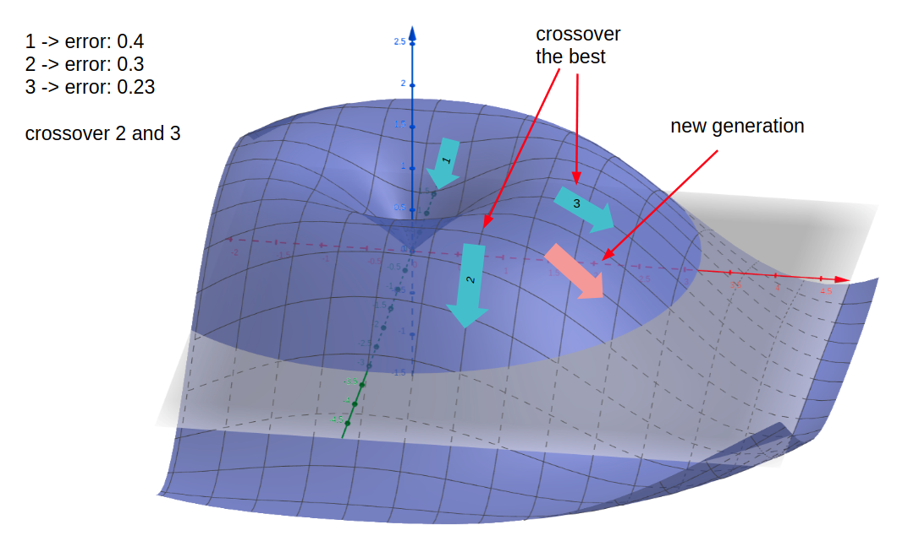
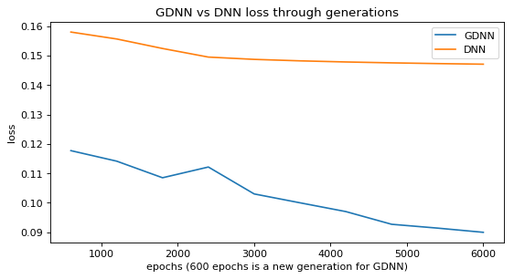

# Genetic Deep Learning
This project aims to use genetic algorithms to boost the learning of DNN.  Building and training a family  of NN with same structure and hyperparameters from scratch but starting from different random weights.   After a few epochs of training, the networks that perform better are chosen and crossed over their weights together in order to mating between pairs and produce the next generation. 

Main problems to solve with NN:

- Architecture optimization:finding optimal layers and number of nodes in each layer of the network required to capture features from given data.
- Hyperparameter optimization: refers to choosing values of hyperparameters like - learning rate, optimization algorithm, dropout rate, batch size, etc. 

- Weight optimization: fiend the right values for each neuron within each weight in order to solve the general equation with a minimum error.

this project focuses on solving the third of the problems, using Genetic Algorithms combined with Gradient Descent implement method of solving the weight optimization problem.

## Intuition of how gradients of the new generation improves the chosen slope when mating the fittest

 The ”Survival of the Fittest” scheme, proposed by Charles Darwin in his Theory of Natural Selection, is used.  The mating process takes place after every ’n’ epoch, in this example n=600. After the first generation of parents are trained for ’n’ iterations, their dominance is calculated based on their ability to reduce loss.  Networks that achieve less loss are selected to create the new generation.

Comparison of the loss of the GDNN, choosing the best NN within each generation (where each generations occurs within 600 epochs),  vs the loss of DNN.

